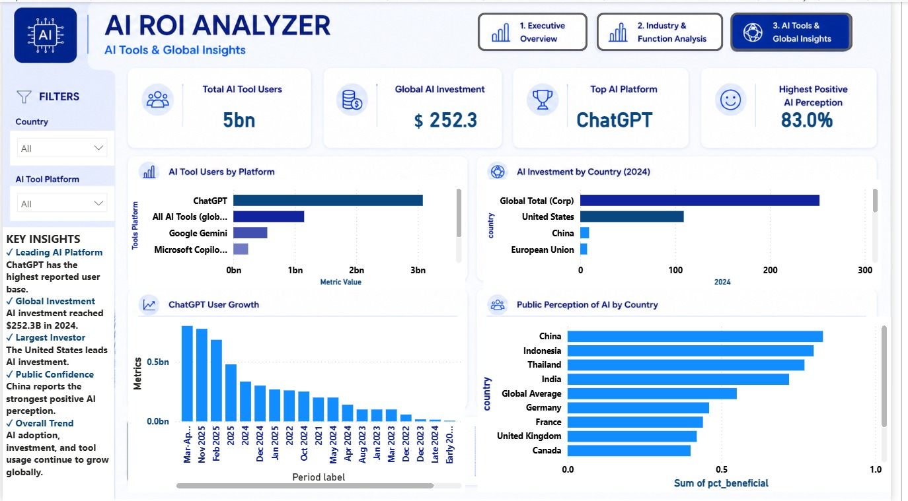

# 🚀 AI ROI Analyzer

> **An end-to-end Business Intelligence project built using SQL and Power BI to analyze global AI adoption, investment trends, business functions, industry adoption, and public perception.**

---

## 📌 Project Overview

Artificial Intelligence is transforming industries worldwide, but organizations need data-driven insights to understand where AI creates the greatest business value.

This project combines **SQL** and **Power BI** to transform raw datasets into an interactive dashboard that provides meaningful insights into AI adoption, investment patterns, industry trends, and public perception.

---

## 🎯 Business Problem

Organizations want answers to questions such as:

- 🌍 Which countries invest the most in AI?
- 📈 How has AI adoption changed over time?
- 🏢 Which industries are leading AI adoption?
- 💼 Which business functions use AI the most?
- 😊 What is the public perception of AI across countries?

---

## 🛠️ Tools & Technologies

| Tool | Purpose |
|------|---------|
| 🗄 SQL | Data Extraction & Analysis |
| 📊 Power BI | Dashboard Development |
| 📐 DAX | KPI & Measure Creation |
| 🔄 Power Query | Data Transformation |
| 📈 Data Visualization | Business Insights |

---

# 📊 Dashboard Pages

## 1️⃣ Executive Overview

- 📌 Global AI Adoption
- 💰 AI Investment
- 🌍 Public Perception
- 📈 Executive KPIs

---

## 2️⃣ Industry & Function Analysis

- 🏢 Industry Adoption
- 💼 Business Function Analysis
- 📈 Growth Comparison
- 🔍 Industry Insights

---

## 3️⃣ AI Tools & Global Insights

- 🤖 AI Tool Usage
- 🌍 Country Comparison
- 💰 Investment Analysis
- 😊 Public Sentiment

---

# ✨ Key Insights

✔ AI adoption has increased significantly in recent years.

✔ Technology and Financial Services are among the leading industries adopting AI.

✔ AI investment varies considerably across countries.

✔ Marketing & Sales and Service Operations are among the top business functions using AI.

✔ Public perception of AI differs across regions.

---

# 📂 Repository Structure

```
AI-ROI-Analyzer
│
├── 📁 Dataset
│   ├── 1_org_adoption.csv
│   ├── 2_business_function.csv
│   ├── 3_ai_tool_users.csv
│   ├── 4_investment_by_country.csv
│   ├── 5_industry_adoption.csv
│   ├── 6_sentiment_by_country.csv
│   └── 7_kpi_summary.csv
│
├── 📄 AI_ROI_Analyzer.sql
├── 📄 AI_ROI_Analyzer.pbix
├── 🖼 page1.jpeg
├── 🖼 page2.jpeg
├── 🖼 page3.jpeg
└── 📘 README.md
```

---

# 📸 Dashboard Preview

## 🏠 Executive Overview


---

## 📈 Industry & Function Analysis


---

## 🌍 AI Tools & Global Insights



---

# 💡 Skills Demonstrated

- ✅ SQL
- ✅ Power BI
- ✅ DAX
- ✅ Power Query
- ✅ Data Cleaning
- ✅ Data Modeling
- ✅ KPI Development
- ✅ Dashboard Design
- ✅ Business Intelligence
- ✅ Data Storytelling

---

# 👩‍💻 Author

**Jahnavi Poddar**
🌐 GitHub: https://github.com/jahnavipoddarr

---

⭐ If you found this project interesting, feel free to star the repository!


---

⭐ If you found this project interesting, feel free to star the repository!
